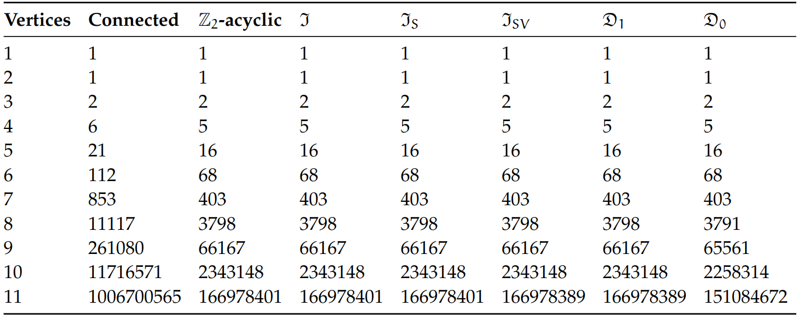
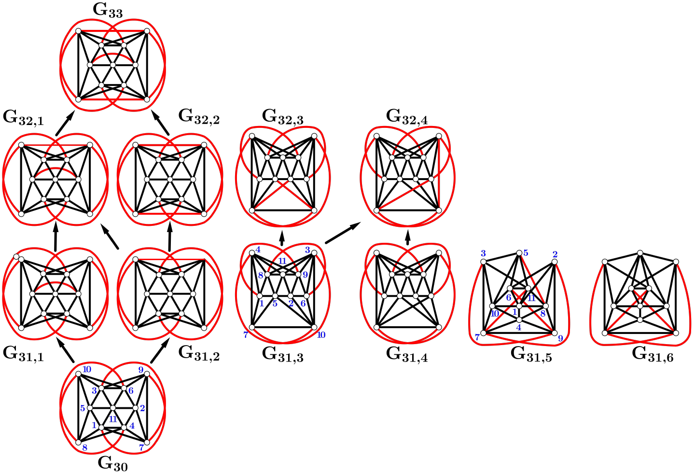
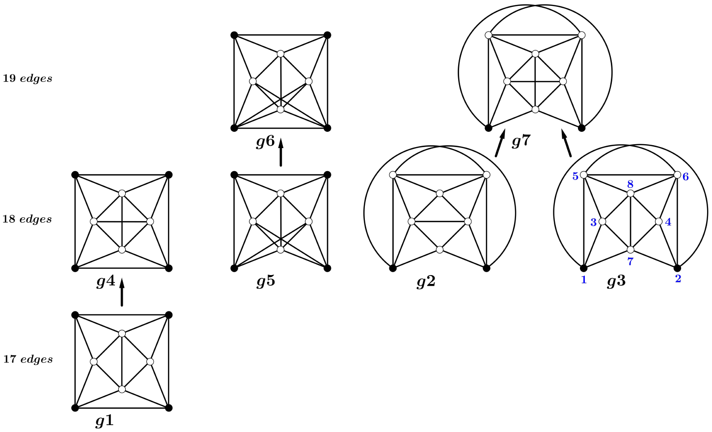

# Minimal graphs for contractible and dismantlable properties
In this repository we demonstrate how to implement the algorithms used in the article *Minimal graphs for contractible and dismantlable properties*
 ([arXiv:2109.06729 [math.CO]](https://arxiv.org/abs/2109.06729)), in order to obtain the numbers listed in Table 1 of that paper:
 
 
**Table 1.** Contractible and dismantlable classes of graphs on at most 11 vertices.

This work considers simple connected graphs on up to 11 vertices.

## Connected graphs
A list of connected graphs on up to 11 vertices was obtained from the well-known repository of Professor Brendan McKay (available online at [Graphs](https://users.cecs.anu.edu.au/~bdm/data/graphs.html)). There the graphs are organized into files according to the number of vertices: `graph2c.g6`, `graph3c.g6`, ... , `graph10c.g6`, `graph11.g6`. The last two files need to be unzipped due to their size.

**Remark**: The file `graph11.g6` contains connected and disconnected graphs, the other ones consist only of connected graphs.

For more details about the g6 format (among other aspects) consult: [graph formats](https://users.cecs.anu.edu.au/~bdm/data/formats.html).

## Setup files 
To facilitate our work we have further divided the files according to how many edges the graphs have. For graphs with 11 vertices, we have created a folder that contains several files of at most one million graphs. The first of these files are
`11v17e-001` and `11v17e-002`.

Additionally, we have introduced a slight variant to the g6 format. This consists of ignoring the data that indicates the number of vertices, called N(n) by McKay. We have called this format \_g6. The number of vertices is known based on which file the graph comes from.

When compiling and running the program [Windows/split.cpp](./Windows/split.cpp), the file structure contained in the `cg` folder will be generated containing the connected graphs up to 11 vertices in \_g6 format, as well as the files `#cgV.dat` and `#cgVE.dat` containing cardinalities. The output of this script is written in the second column in Table 1 of the paper *Minimal graphs for contractible and dismantlable properties* ([arXiv:2109.06729 [math.CO]](https://arxiv.org/abs/2109.06729)).

Running GNU/Linux one can use the script [GNU-Linux/split.cpp](./GNU-Linux/split.cpp), which can be compiled and executed in the terminal (command line) as:
```
> g++ split.cpp -o split
> ./split
```
We have used the following version of the compiler:
```
> g++ --version
g++ (Debian 10.2.1-6) 10.2.1 20210110
```
On a laptop with a processor Intel(R) Xeon(R) CPU E3-1535M v6 @ 3.10GHz, the execution of the script `split.cpp` takes about 25 minutes, no more than 4 GiB of RAM is needed and the output consists of 1169 files distributed in 34 sub-folders in `./cg`, with a total size of 10.4 GiB.

The working folder is where the `cg` folder is located. From now on, all graphs are stored in \_g6 format.

## Acyclic graphs
We have produced an adaptation of the [Ripser](https://github.com/Ripser/ripser) program in order to generate acyclic graphs (that is, graphs whose clique complex have trivial homology with Z/2Z coefficients).

When compiling and running the program [Windows/acyclic.cpp](./Windows/acyclic.cpp), a directories structure will be generated in the `ag` folder containing all acyclic graphs on the specified number of vertices (and edges, if desired).

For the execution of `acyclic.cpp` the [Windows/FlagAcyclic.dat](./Windows/FlagAcyclic.dat) file is required, which contains a 0 to indicate that the file structure of `ag` has not been created yet. Its value will change to 1 with the first execution of the `acyclic.cpp` program.

Running GNU/Linux one can use the script [GNU-Linux/acyclic.cpp](./GNU-Linux/acyclic.cpp), which can be compiled and executed in the terminal as:
```
> g++ acyclic.cpp -o acyclic
> ./acyclic
```
In this case, the file `FlagAcyclic.dat` (available here: [GNU-Linux/FlagAcyclic.dat](./GNU-Linux/FlagAcyclic.dat)) must also be located in the work directory and initialized in 0; otherwise, a "Segmentation fault" message will be displayed.

Simultaneous executions of `acyclic.cpp` can be performed running Windows by opening several instances. If running GNU/Linux one can use the bash script [GNU-Linux/acyclic_runner](./GNU-Linux/acyclic_runner) to send all processes to the background and use all the available cores of the computer. 
```
> chmod a+x acyclic_runner
> ./acyclic_runner
```
On our personal computer this script takes about 4 days to be completed, no more than 8 GiB of RAM is needed, and the output consists of 2338 files distributed in 34 sub-folders in `ag`, with a total size of 1.7 GiB.

Of course, in Windows as well as in GNU/Linux, the script `acyclic` can be executed manually as follows:<br />
acyclic 1<br />
acyclic 2<br />
... <br />
acyclic 10<br />
acyclic 11 10<br />
acyclic 11 11<br />
...<br />
acyclic 11 16<br />
acyclic 11 17 1<br />
acyclic 11 17 2<br />
acyclic 11 18 1<br />
acyclic 11 18 2<br />
acyclic 11 18 3<br />
acyclic 11 18 4<br />
acyclic 11 19 1<br />
...<br />
acyclic 11 19 8<br />
acyclic 11 20 1<br />
...<br />
acyclic 11 38 3<br />
acyclic 11 39 1<br />
acyclic 11 39 2<br />
acyclic 11 40<br />
acyclic 11 41<br />
...<br />
acyclic 11 55<br />

The complete detailed list to needed to execute these commands using Windows can be found at [Windows/acyclic_run_parallel.dat](./Windows/acyclic_run_parallel.dat). We suggest running these commands in parallel with a computer running a GNU/Linux operating system. Otherwise a couple of weeks of computation may be required. If so desired, the output of these runs can be downloaded from the page [Geometric and Combinatorial Structures](http://gcs.mat.uson.mx/index.php/8-research/4-acyclic-graphs).

At the end of the complete list of executions, the [Windows/acyclic_cardinalities.cpp](./Windows/acyclic_cardinalities.cpp) program must be compiled and executed to collect the cardinalities of acyclic graphs, and the files `#agV.dat` and `#agVE.dat` will be generated. If any file is missing after one of the `acyclic.cpp` program executions, the execution of `acyclic_cardinalities.cpp` will inform the user. Running GNU/Linux, the same script ([GNU-Linux/acyclic_cardinalities.cpp](./GNU-Linux/acyclic_cardinalities.cpp)) works well:
```
> g++ acyclic_cardinalities.cpp -o acyclic_cardinalities
> ./acyclic_cardinalities
```
The output of such script is written in the third column in Table 1.

## The family of Strong I-Contractible graphs
One can compute the family of Strong I-Contractible graphs, independently of the computation of the family of acyclic graphs. For this, one can compie and execute the script [Windows/Sic.cpp](./Windows/Sic.cpp) usingrWindows; or [GNU-Linux/Sic.cpp](./GNU-Linux/Sic.cpp) using GNU/Linux:
```
> g++ Sic.cpp -o Sic
> ./Sic 1
> ./Sic 2
...
> ./Sic 10
> ./Sic 11 10
> ./Sic 11 11
...
> ./Sic 11 16
> ./Sic 11 17 1
> ./Sic 11 17 2
> ./Sic 11 18 1
> ./Sic 11 18 2
> ./Sic 11 18 3
> ./Sic 11 18 4
> ./Sic 11 19 1
...
> ./Sic 11 19 8
> ./Sic 11 20 1
...
> ./Sic 11 38 3
> ./Sic 11 39 1
> ./Sic 11 39 2
> ./Sic 11 40
...
> ./Sic 11 55
```
This produces the same list as for the acyclic graphs. Of course, simultaneous executions of `Sic.cpp` can be performed using Windows by opening several instances. Using GNU/Linux one can run the bash script [GNU-Linux/Sic_runner](./GNU-Linux/Sic_runner), to send all processes to the background and use all the available cores of the computer. On our personal computer this bash script takes about 40 minutes to be completed, no more than 4 GiB of RAM is needed and the output consists of 2338 files distributed in 34 sub-folders in `sic`, with a total size of 1.7 GiB.

After the above computation, one can compile and execute the script [Windows/Sic_cardinalities.cpp](./Windows/Sic_cardinalities.cpp), or [GNU-Linux/Sic_cardinalities.cpp](./GNU-Linux/Sic_cardinalities.cpp) depending on operating system, to collect the cardinalities of the strong I-contractible graphs, partitionated by number or vertices. 
```
> g++ Sic_cardinalities.cpp -o Sic_cardinalities
> ./Sic_cardinalities
```
The cardinalities obtained in the file `#sicV.dat` correspond to the numbers in the 5th column in Table 1. On the other hand, it is known that every strong I-contractible graph is I-contractible (and hence acyclic), and furthermore that the number of acyclic and strong I-contractible graphs coincide for graphs up to 11 vertices. Hence the fourth column (related to the I-contractible graphs) must coincide with those.

## Graphs that are Strong I-Contractible but not Strong Vertex I-Contractible

From the collection of acyclic graphs we obtain the graphs that are SIC but not SVIC by compiling and executing the program [Windows/GetSpecialG.cpp](./Windows/GetSpecialG.cpp). From this we obtain 12 graphs, which are collected in [Windows/SpecialG.dat](./Windows/SpecialG.dat). Such graphs are depicted in Figure 1 of the article [Minimal graphs for contractible and dismantlable properties](https://arxiv.org/abs/2109.06729).


**Figure 1.** Minimal examples of graphs that are in SIC but not in SVIC.

Running GNU/Linux one can use the same script, downloaded from [GNU-Linux/GetSpecialG.cpp](./GNU-Linux/GetSpecialG.cpp), compiled and executed as follows:
```
> g++ GetSpecialG.cpp -o GetSpecialG
> ./GetSpecialG
```
In [GNU-Linux/SpecialG.dat](./GNU-Linux/SpecialG.dat) one can also view the 12 graphs that account for the difference between columns 5 and 6 in Table 1. The run takes about 30 minutes on our personal computer.

## Ivashchenko's axiom
The program [Windows/CheckAxiom.cpp](./Windows/CheckAxiom.cpp), as well as [GNU-Linux/CheckAxiom.cpp](./GNU-Linux/CheckAxiom.cpp), examines graphs up to 9 vertices and provides adjacency matrices for graphs that violate this "axiom".  The output from this program is available at [Windows/CheckAxiom.cpp](./Windows/CheckAxiom.cpp) ([GNU-Linux/CheckAxiom.cpp](./GNU-Linux/CheckAxiom.cpp), respectively). On GNU/Linux one can compile and execute this program as follows:
```
> g++ CheckAxiom.cpp -o CheckAxiom
> ./CheckAxiom
```
The full process takes a few seconds.

## Acyclic graphs that are not 0-dismantable
We obtain graphs that are acyclic but not 0-dismantlable by compiling and running the program [Windows/1dismtbl-0dismtbl.cpp](./Windows/1dismtbl-0dismtbl.cpp) on Windows, or [GNU-Linux/1dismtbl-0dismtbl.cpp](./GNU-Linux/1dismtbl-0dismtbl.cpp) on GNU/Linux, as follows:
```
> g++ 1dismtbl-0dismtbl.cpp -o 1dismtbl-0dismtbl
> ./1dismtbl-0dismtbl
```

The resulting 7 graphs are in the output file `1dismtbl-0dismtbl.dat` (available here [Windows/1dismtbl-0dismtbl.dat](./Windows/1dismtbl-0dismtbl.dat) and here [GNU-Linux/1dismtbl-0dismtbl.dat](./GNU-Linux/1dismtbl-0dismtbl.dat)) and correspond to the graphs depicted in Figure 5 of the article [Minimal graphs for contractible and dismantlable properties](https://arxiv.org/abs/2109.06729).


**Figure 5.** The smallest graphs that are 1-dismantlable (and hence strong vertex I-contractible) but not 0-dismantlable.

## Contact
For more information or issues regarding the code, please email hector.hernandez@unison.mx or jesusfrancisco.espinoza@unison.mx.
